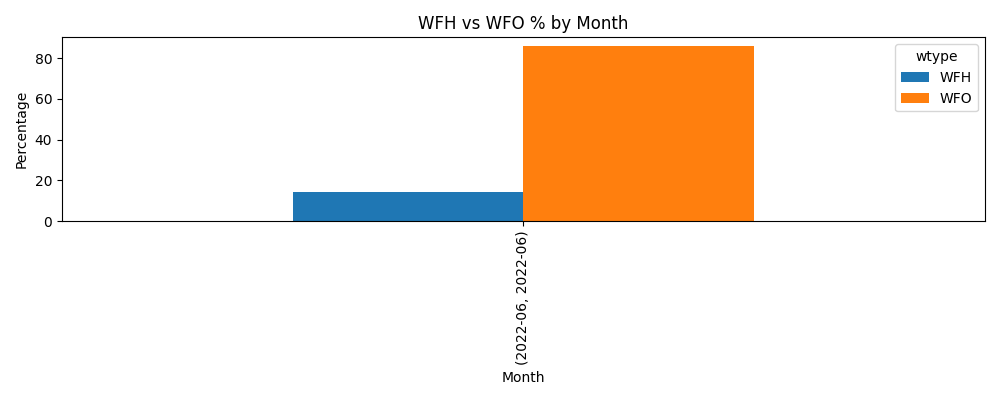
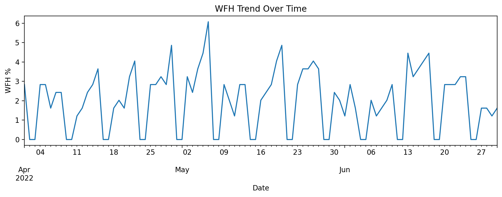
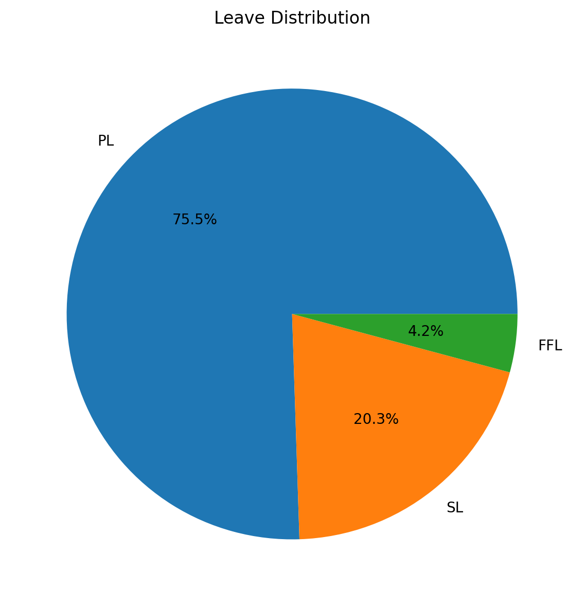

## 📊 AtliQ HR Attendance Analytics

<p align="center">  </p>
 


## 📊 Python-Based HR Attendance Insights (Apr–Jun 2022)

This project analyzes 3 months of employee attendance data for AtliQ Technologies, delivering insights into:

📅 Monthly attendance patterns  
🏠 WFH vs 🏢 WFO behavior and trends  
📈 Work-from-home adoption over time  
📉 Workforce absenteeism and leave distribution  
🎯 Data-driven insights into workforce flexibility and engagement

---

The full analysis was performed using Python (Pandas, NumPy, Matplotlib) to demonstrate end-to-end:

✔ Data cleaning

✔ Data transformation

✔ KPI engineering

✔ Insights & visualization

---

## 🛠 Technologies Used

- **Language:** Python  
- **Libraries:** Pandas, NumPy, Matplotlib  
- **Environment:** Jupyter Notebook  
- **Techniques:**  
  - Data Cleaning & Transformation  
  - KPI Engineering  
  - Time-Series Analysis  
  - Data Visualization  

---

## 📌 Key KPIs Generated

### Monthly KPIs
- **Attendance %** (Present + Work From Home)
- **WFH %** — Hybrid work adoption trend
- **WFO %** — Office attendance trend
- **Sick Leave %** — Health-related leave behavior
- **Paid Leave %** — Scheduled leave impact

---

## 🧮 3-Month KPI Summary (Overall)

Average Attendance %: 91.70%

Average WFH %: 10.28%

Average WFO %: 81.42%

Average Sick Leave %: 1.29%

Average Paid Leave %: 3.95%

---

## 🛠 Project Workflow

Steps	Description
1. Data Import	Loaded April, May, June sheets from Excel

2. Cleaning & Standardization	Fixed column names, removed noise, unified date formats

3. Reshaping Data	Converted daily attendance columns → long-format dataset

4. Status Mapping	Replaced codes (P, WFH, SL, etc.) with meaningful labels

5. KPI Calculation	Monthly & overall KPIs computed dynamically

6. Visualizations	Trend charts & summary dashboards

7. Insight Building	Identified patterns & HR-relevant findings

---
 
## 💡 Insights Overview

Here are examples of insights revealed:

📈 WFH increased month-by-month, indicating rising hybrid adoption

🏢 WFO steadily decreased, hinting at shifting workforce preference

🤒 Sick leave spiked in May, suggesting wellness issues or seasonal patterns

📉 Attendance dipped slightly, driven mostly by paid leave

---

## 📈 Visualizations & Insights

### 1️⃣ WFH vs WFO % by Month

 
📊 Insight:

Work-from-Home (WFH) adoption increases steadily from April to June, indicating a shift toward hybrid work flexibility.

---

### 2️⃣ WFH Trend Over Time


📈 Insight: 

WFH usage shows consistent growth with daily fluctuations, becoming more prominent toward June.

---

### 3️⃣ Workforce Absenteeism Analysis


📉 Insight:

Sick Leave (SL) represents the largest share of absences, highlighting health-related factors as the primary driver of employee absence.

---

## 📂 Repository Structure
AtliQ-HR-Attendance-Analytics/
│

├── notebooks/
│   └── AtliQ_HR_Attendance_Analysis.ipynb
│

├── scripts/

│  ├── data_cleaning.py
│  ├── kpi_calculations.py
│  ├── visualizations.py
│  └── utils.py

│
├── assets/│   

├── AtliQ_HR_Attendance_Banner_README.jpg
│   └── charts/
│      ├── wfh_wfo_monthly.png
│     └── sick_leave_monthly.png
│

├── README.md

└── requirements.txt

---

## 🧠 Code Structure

- `notebooks/` → Exploratory analysis & KPI derivation
- `scripts/` → Modular Python code for cleaning, KPI calculation, and visualization
- `assets/` → Charts and visual assets used in the analysis

---

## 🧩 Python Code Organization

- **`data_cleaning.py`**  
  Handles column standardization, date parsing, reshaping (melt), and status mapping.

- **`kpi_calculations.py`**  
  Contains reusable functions for calculating attendance, WFH, WFO, sick leave, and paid leave KPIs.

- **`visualizations.py`**  
  Generates all charts used in the analysis using Matplotlib.

- **`utils.py`**  
  Helper functions to keep code modular and clean.

---

## 🚀 How to Run This Project


1. Clone the repository

```bash
git clone https://github.com/asimahmedhub/AtliQ-HR-Attendance-Analytics.git
cd AtliQ-HR-Attendance-Analytics

   
2. Install dependencies

   pip install -r requirements.txt


3. Update the Excel file path inside run_pipeline.py

  EXCEL_FILE = Path(r"C:\Users\Asim\Desktop\Attendance-Sheet-2022-2023.xlsx")


4. Run the pipeline

python run_pipeline.py


5. explore the notebook version
jupyter notebook


### Then:
- Scroll down
- Click **Commit changes**
- Use this commit message:
```text
Add how to run section to README
---


## 👨‍💻 Developed By

Asim Ahmed — Data Analyst

📧 Email: asim.atia@gmail.com

🔗 GitHub: https://github.com/asimahmedhub

🔗 LinkedIn: (Add your link)
